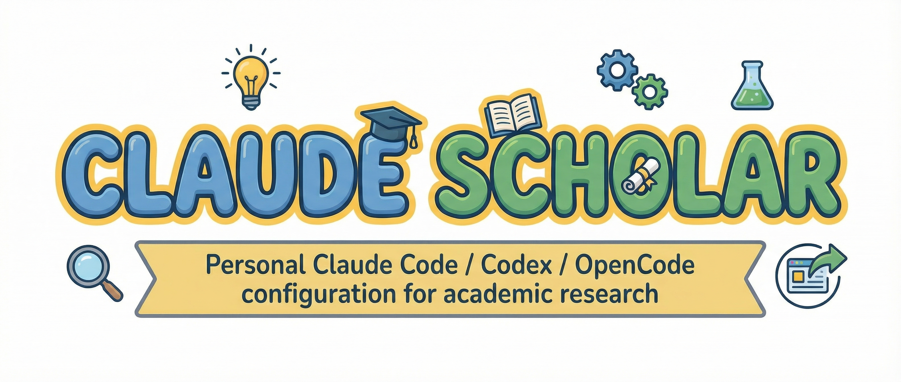

<div align="center">
  

  <p>
    <a href="https://github.com/Galaxy-Dawn/claude-scholar/stargazers"></a>
    <a href="https://github.com/Galaxy-Dawn/claude-scholar/network/members"></a>
    
    
    
  </p>

  <strong>语言</strong>: <a href="README.md">English</a> | <a href="README.zh-CN.md">中文</a>
</div>

> 面向学术研究和软件开发的半自动研究助手，尤其适合计算机科学与 AI 研究者，已适配 [Codex CLI](https://github.com/openai/codex)，覆盖研究构思、文献综述、实验、结果报告、写作与项目知识库维护。
>
> **分支说明**：这是 Claude Scholar 的 **Codex CLI 版本**。Claude Code 版本请查看 [`main` 分支](https://github.com/Galaxy-Dawn/claude-scholar/tree/main)，OpenCode 版本请查看 [`opencode` 分支](https://github.com/Galaxy-Dawn/claude-scholar/tree/opencode)。

## 最新动态

- **2026-03-18**: **实验结果报告、写作记忆与 README 对齐** — 保留了 `results-analysis` / `results-report` 的双层职责划分：前者负责严格统计与真实科研图，后者负责面向决策的实验后总结报告；继续保留 Obsidian 写回；从产品叙事中移除了旧的 `data-analyst` 入口；把 `paper-miner` 的输出沉淀到共享写作记忆，并让 `ml-paper-writing` 与 `review-response` 统一读取；同时把 Codex 分支 README 的结构向主分支主线对齐，但保留 Codex 专有用法说明。
- **2026-03-17**: **Obsidian 项目知识库** — 已将以文件系统为核心的 Obsidian 工作流迁入 Codex 版，支持项目导入、repo 绑定后的自动同步，将稳定知识路由到 `Papers / Knowledge / Experiments / Results / Writing`，并将具体轮次的实验报告存放在 `Results/Reports/` 下，且 Obsidian 侧不依赖 MCP。
- **2026-02-26**: **Zotero MCP Web API 模式** — 支持远程 Zotero 访问、DOI/arXiv/URL 导入、集合管理、条目更新，并补充了 Codex `config.toml` 配置说明。

<details>
<summary>查看历史更新日志</summary>

- **2026-02-25**: **Codex CLI 迁移** — 将项目迁入 Codex CLI 形态，包含 TOML 配置、agent 目录、基于 AGENTS 的工作约束与增量安装器
- **2026-02-23**: 新增 `setup.sh` 安装脚本 — 面向已有 `~/.codex` 的带备份增量更新，并支持保留现有配置与可选启用 Zotero MCP
- **2026-02-22**: 新增 Zotero MCP 模板 — 在 Codex 中提供开箱即用的文献工作流模板
- **2026-02-21**: 完成 OpenCode 迁移铺垫 — 明确 Claude Code、Codex、OpenCode 三条分支线的分工
- **2026-02-15**: Zotero MCP 集成 — 将 `/zotero-review`、`/zotero-notes` 风格的文献工作流并入更大的 Claude Scholar 主线
- **2026-02-11**: 大版本更新 — 扩展研究技能、agents 与学术工作流覆盖范围
- **2026-01-25**: 项目正式开源，v1.0.0 发布

</details>

## 快速导航

| 部分 | 作用 |
|---|---|
| [为什么使用 Claude Scholar](#为什么使用-claude-scholar) | 快速理解项目定位与适用场景。 |
| [核心工作流](#核心工作流) | 查看从研究构思到发表的分阶段主链路。 |
| [快速开始](#快速开始) | 安全地安装到现有 `~/.codex` 环境。 |
| [平台范围](#平台范围) | 了解这个分支覆盖什么，以及其他版本在哪。 |
| [集成能力](#集成能力) | 了解 Zotero 和 Obsidian 如何接入 Codex 工作流。 |
| [主要工作流](#主要工作流) | 浏览核心研究与开发工作流。 |
| [支撑工作流](#支撑工作流) | 查看强化主工作流的后台机制。 |
| [文档入口](#文档入口) | 跳转到安装、配置与 setup 文档。 |
| [引用](#引用) | 在论文、报告或项目文档中引用 Claude Scholar。 |

## 为什么使用 Claude Scholar

Claude Scholar **不是**一个试图替代研究者的端到端全自动科研系统。

它的核心思想很简单：

> **人的决策始终在中心，助手负责加速围绕它展开的科研流程。**

这意味着 Codex 版更适合承担科研中那些高重复、重结构、但仍需要人来把关的部分——例如文献整理、笔记沉淀、实验分析、结果汇报和写作辅助——而真正关键的判断仍然应该由研究者自己做出：

- 哪个问题值得做，
- 哪些论文真的重要，
- 哪些假设值得检验，
- 哪些结果足够有说服力，
- 以及什么该继续、该写、该投，或者该放弃。

换句话说，Claude Scholar 是一个**半自动研究助手**，而不是“全自动科学家”。

## 更适合谁

Claude Scholar 当前尤其适合：

- **计算机科学研究者**：需要在文献、代码、实验和论文写作之间频繁切换；
- **AI / ML researcher**：希望用一套工作流串起构思、实现、分析、报告和 rebuttal；
- **research engineer 与研究生**：希望引入更强的流程结构，但不放弃人的判断；
- **偏软件与计算驱动的学术项目**：能够直接受益于 Zotero、Obsidian、CLI 自动化和可追踪的 project memory。

它当然也可以帮助其他研究场景，但当前这套工作流的设计重心，最贴近计算机科学、AI 以及相邻的 computational research。

## 核心工作流

- **研究构思**：把模糊主题收敛成具体研究问题、研究空白和初步计划。
- **文献工作流**：通过 Zotero 文献集合检索、导入、组织并阅读论文。
- **论文笔记**：把论文转成结构化阅读笔记和可复用论点。
- **知识库沉淀**：将稳定知识写入 Obsidian，并按 `Papers / Knowledge / Experiments / Results / Writing` 路由整理，具体轮次的实验报告存放在 `Results/Reports/` 下。
- **实验推进**：跟踪假设、实验线、运行历史、关键发现和下一步动作。
- **严格分析**：使用 `results-analysis` 生成严谨统计、真实科研图和分析产物。
- **结果报告**：使用 `results-report` 生成完整实验后总结报告，并写回 Obsidian。
- **写作与发表**：把稳定结论延伸到综述、论文、rebuttal、演示文稿、海报和传播材料中。

## 快速开始

### 系统要求

- [Codex CLI](https://github.com/openai/codex)
- Git
- （可选）Python + [uv](https://docs.astral.sh/uv/) 用于 Python 开发
- （可选）[Zotero](https://www.zotero.org/) + [Galaxy-Dawn/zotero-mcp](https://github.com/Galaxy-Dawn/zotero-mcp) 用于文献工作流
- （可选）[Obsidian](https://obsidian.md/) 用于项目知识库工作流

### 选项 1：完整安装（推荐）

```bash
git clone -b codex https://github.com/Galaxy-Dawn/claude-scholar.git /tmp/claude-scholar
bash /tmp/claude-scholar/scripts/setup.sh
```

安装器现在支持**带备份的安全增量更新**：
- 同步仓库托管的 `skills/`、`agents/`、`scripts/` 与 `utils/`
- 当你选择保留现有 provider/model 时，把 Claude Scholar 所需 section 合并进现有 `~/.codex/config.toml`
- 覆盖前自动备份 `config.toml` 与 `auth.json`
- 如果已存在 `~/.codex/AGENTS.md`，则保留原文件，并把仓库版本另存为 `~/.codex/AGENTS.scholar.md`
- 在增量更新路径下保留现有 provider / model / API key
- 可选启用模板中已经存在的 Zotero MCP 配置块

以后做增量更新时：

```bash
cd /tmp/claude-scholar
git pull --ff-only
bash scripts/setup.sh
```

### 选项 2：最小化安装

只安装较小的一组研究工作流子集：

```bash
git clone -b codex https://github.com/Galaxy-Dawn/claude-scholar.git /tmp/claude-scholar
mkdir -p ~/.codex/skills ~/.codex/agents
cp -r /tmp/claude-scholar/skills/research-ideation ~/.codex/skills/
cp -r /tmp/claude-scholar/skills/results-analysis ~/.codex/skills/
cp -r /tmp/claude-scholar/skills/results-report ~/.codex/skills/
cp -r /tmp/claude-scholar/skills/ml-paper-writing ~/.codex/skills/
cp -r /tmp/claude-scholar/skills/review-response ~/.codex/skills/
cp -r /tmp/claude-scholar/agents/literature-reviewer ~/.codex/agents/
cp -r /tmp/claude-scholar/agents/paper-miner ~/.codex/agents/
cp /tmp/claude-scholar/AGENTS.md ~/.codex/AGENTS.md
```

**安装后**：最小化/手动安装**不会自动合并** `config.toml`；请根据需要手动复制仓库配置与 setup 文档里的相关 section。

### 选项 3：选择性安装

只复制你需要的部分：

```bash
git clone -b codex https://github.com/Galaxy-Dawn/claude-scholar.git /tmp/claude-scholar
cp -r /tmp/claude-scholar/skills/<skill-name> ~/.codex/skills/
cp -r /tmp/claude-scholar/agents/<agent-name> ~/.codex/agents/
cp /tmp/claude-scholar/AGENTS.md ~/.codex/AGENTS.md
```

**Codex 使用说明**：
- Codex **不会**在 `/...` 菜单里列出自定义 skills。
- 优先使用自然语言触发；必要时可显式写 `$skill-name`。

## 平台范围

这个分支面向 **Codex CLI**。

- **Codex CLI（`codex` 分支）** — TOML 配置、AGENTS 驱动的工作约束、以文件系统为核心的 Obsidian 工作流，以及 Codex 专用安装文档
- **Claude Code（`main` 分支）** — Claude Code 配置、原生 hooks，以及主线文档组织方式
- **OpenCode（`opencode` 分支）** — OpenCode 专用配置与安装路径

三条分支尽量共享研究工作流主线，但平台层的操作方式不同。

## 集成能力

### Zotero

适合这些场景：
- 通过 DOI / arXiv / URL 导入论文
- 按文献集合批量阅读论文
- 通过 Zotero MCP 读取全文
- 生成详细论文笔记与文献综合分析

详见 [MCP_SETUP.zh-CN.md](./MCP_SETUP.zh-CN.md)。

### Obsidian

适合这些场景：
- 维护以文件系统为核心的项目知识库
- 管理 `Papers/`
- 管理 `Knowledge/`
- 管理 `Experiments/`
- 管理 `Results/`
- 管理 `Results/Reports/`
- 管理 `Writing/` 与 `Daily/`

详见 [OBSIDIAN_SETUP.zh-CN.md](./OBSIDIAN_SETUP.zh-CN.md)。

## 主要工作流

完整学术研究生命周期 —— 从研究构思到发表的 7 个阶段。

> **Codex 入口说明**：这个分支不依赖仓库级 slash commands。默认入口是自然语言触发；必要时可显式调用 `$results-analysis` 这样的 skill。

### 1. 研究构思（Zotero 集成）

把模糊主题收敛成有文献支持的研究方向。

| 类型 | 名字 | 一句话解释 |
|---|---|---|
| Skill | `research-ideation` | 把模糊主题转成结构化问题、研究空白分析和初步研究计划。 |
| Agent | `literature-reviewer` | 搜索、分类并综合论文，形成可执行的文献图景。 |
| Skill | `zotero-obsidian-bridge` | 将 Zotero 文献集合衔接到详细论文笔记和后续 Obsidian 知识库工作流。 |

**工作方式**
- **5W1H 头脑风暴**：把模糊兴趣收敛成结构化问题。
- **文献检索与导入**：搜索论文、提取 DOI/arXiv/URL、导入 Zotero，并组织到主题文献集合。
- **PDF 与全文**：能挂 PDF 就挂 PDF，能读全文就读全文。
- **研究空白分析**：识别文献、方法、应用、跨学科和时间维度的研究空白。
- **研究问题与规划**：把文献综合结果转成具体问题、初始假设和下一步动作。

**典型产出**
- 文献综述笔记
- 结构化 Zotero 文献集合
- 研究提案或方向草稿

### 2. ML 项目开发

面向实验代码与仓库维护的可持续 ML 开发工作流。

| 类型 | 名字 | 一句话解释 |
|---|---|---|
| Skill | `architecture-design` | 在新增可注册组件或新模块时设计可维护的 ML 项目结构。 |
| Skill | `git-workflow` | 约束更安全的分支协作、提交规范和 Git 习惯。 |
| Skill | `bug-detective` | 系统化排查 stack trace、shell 报错和断裂的代码路径。 |
| Skill | `git-commit` | 在本地生成符合 Conventional Commits 的提交。 |
| Skill | `git-push` | 按 Conventional Commits 完成暂存、提交和推送。 |
| Agent | `code-reviewer` | 审查改动代码的正确性、可维护性和实现质量。 |
| Agent | `dev-planner` | 把复杂工程任务拆成可执行的实现步骤。 |

**工作方式**
- **结构设计**：在合适场景下使用 Factory / Registry 模式。
- **代码质量**：保持文件可读、带类型提示、配置驱动。
- **问题排查**：系统化处理 shell 失败、trace 与路径问题。
- **Git 纪律**：在快速迭代时保持更安全的分支和提交流程。

### 3. 实验分析

严格实验分析工作流：统计、科研图、分析产物与实验后报告。

| 类型 | 名字 | 一句话解释 |
|---|---|---|
| Skill | `results-analysis` | 生成严格统计、真实科研图和分析附录。 |
| Skill | `results-report` | 把分析产物组织成完整实验后总结报告，明确结论、限制和下一步动作。 |
| Agent | `research-knowledge-curator-obsidian` | 在 repo 已绑定时，把稳定结论写回 Obsidian 项目知识库。 |

**工作方式**
- **数据处理**：读取实验日志、metrics 文件和结果目录。
- **统计检验**：在满足前提时执行严格统计检验，并清楚报告不确定性。
- **科研可视化**：生成真实科研图，而不是模糊的绘图建议。
- **消融与比较**：分析组件贡献、性能 tradeoff 与稳定性。
- **实验后报告**：交给 `results-report` 生成面向决策的完整复盘。

**典型产出**
- `analysis-report.md`
- `stats-appendix.md`
- `figure-catalog.md`
- `figures/`
- 写回 Obsidian `Results/Reports/` 的实验报告

### 4. 论文写作

从模板整理到草稿迭代的系统化论文写作工作流。

| 类型 | 名字 | 一句话解释 |
|---|---|---|
| Skill | `ml-paper-writing` | 基于 repo、实验结果和文献上下文撰写投稿导向的 ML/AI 论文。 |
| Skill | `citation-verification` | 检查参考文献、元数据和 claim-citation 对齐。 |
| Skill | `writing-anti-ai` | 减少机械化表达，提升节奏、清晰度和学术语气。 |
| Skill | `latex-conference-template-organizer` | 把会议模板整理成 Overleaf-ready 的写作结构。 |
| Agent | `paper-miner` | 从高质量论文中提炼可复用写作模式、结构信号和投稿经验。 |

**工作方式**
- **模板准备**：把混乱模板清理成可写作结构。
- **引用核验**：检查参考文献、元数据和 claim 支撑关系。
- **系统化写作**：基于 repo 证据和文献上下文逐节写作。
- **写作记忆复用**：通过 `paper-miner` memory 沉淀并复用稳定写作模式。

### 5. 论文自审

投稿前的质量保障工作流。

| 类型 | 名字 | 一句话解释 |
|---|---|---|
| Skill | `paper-self-review` | 在投稿前系统检查结构、逻辑、引用、图表和合规性。 |

**工作方式**
- **结构检查**：检查逻辑流、章节平衡和叙事连贯性。
- **逻辑校验**：检查 claim-evidence 对齐和假设清晰度。
- **引用审计**：核对引用准确性与完整性。
- **图表质量**：检查可读性、caption 和可访问性。
- **合规性检查**：检查页数限制、格式与披露要求。

### 6. 投稿与 Rebuttal

投稿准备与审稿回复工作流。

| 类型 | 名字 | 一句话解释 |
|---|---|---|
| Skill | `review-response` | 把审稿意见组织成基于证据的 rebuttal 工作流。 |
| Agent | `rebuttal-writer` | 起草专业、礼貌且结构清晰的 rebuttal 文本。 |

**工作方式**
- **投稿前检查**：确认会议格式、匿名化和所需清单项。
- **审稿意见分析**：把审稿意见分类成可执行问题。
- **回复策略**：决定是 accept、defend、clarify 还是补实验。
- **Rebuttal 写作**：生成结构化、基于证据、语气专业的回复文档。

### 7. 录用后处理

论文录用后的会议准备与研究传播工作流。

| 类型 | 名字 | 一句话解释 |
|---|---|---|
| Skill | `post-acceptance` | 支持论文录用后的 slides、海报和对外传播材料准备。 |
| Agent | `ui-sketcher` | 在需要时帮助组织 slides、海报与展示流程等视觉材料。 |

**工作方式**
- **报告准备**：准备 talk 结构和演示文稿指导。
- **海报整理**：整理海报内容层级和版式。
- **传播内容**：生成简明的对外摘要、thread 与录用后材料。

## 支撑工作流

这些工作流运行在主工作流背后，用来增强整体 Codex 使用体验。

### Obsidian 项目知识库

把 Obsidian 当作稳定科研知识的沉淀中心，而不是一堆互不相连的零散笔记。

| 类型 | 名字 | 一句话解释 |
|---|---|---|
| Skill | `obsidian-project-memory` | 维护项目级 Obsidian 知识库，并决定哪些稳定知识需要写回。 |
| Skill | `obsidian-project-bootstrap` | 为新项目或已有科研项目初始化对应的 Obsidian 知识库结构。 |
| Skill | `obsidian-research-log` | 将每日研究进展、计划、想法和 TODO 写入知识库。 |
| Skill | `obsidian-experiment-log` | 在 Obsidian 中记录实验设置、运行过程、关键发现和后续动作。 |
| Skill | `obsidian-literature-workflow` | 在 Obsidian 内处理以文件系统为核心的 paper note 规范化与文献综合。 |
| Skill | `zotero-obsidian-bridge` | 把 Zotero 文献集合接到 Obsidian 中的规范论文笔记和文献图谱。 |

**工作方式**
- 将已有 repo 绑定到 Obsidian vault，
- 把稳定知识路由进 `Papers / Knowledge / Experiments / Results / Writing`，具体轮次的实验报告存放在 `Results/Reports/` 下，
- 保守维护 `Daily/` 与项目记忆，
- 把新 Markdown 整理进正确的规范笔记，
- 仅在工作流需要时生成 canvas 或视图。

### Codex 会话约束与 Hook 模拟

Codex 不提供原生 Claude Code hooks，所以这个分支通过 AGENTS 工作约束和本地辅助脚本来模拟最高价值的行为。

| 类型 | 名字 | 一句话解释 |
|---|---|---|
| File | `AGENTS.md` | 编码会话约束、skill 评估规则、安全规则和 Codex 专用工作流说明。 |
| Script | `scripts/codex_hook_emulation.py` | 在仓库工作流内模拟 session-start、preflight、post-edit、session-end 行为。 |
| Skill | `session-wrap-up` | 在会话结束时生成工作日志、清理提醒和收尾总结。 |

**工作方式**
- **会话开始代理**：检查 repo 状态、skills、TODO 和项目上下文。
- **危险操作预检**：在执行危险或不可逆命令前先做 preflight 检查。
- **编辑后检查**：在有意义改动后决定验证需求和最小 Obsidian 写回。
- **会话结束代理**：总结工作并提醒后续维护动作。

### 知识提炼工作流

专门的 agents 会持续从论文和工程方案中提炼可复用知识。

| 类型 | 名字 | 一句话解释 |
|---|---|---|
| Agent | `paper-miner` | 从高质量论文中提炼可复用写作模式、结构信号和回复策略。 |
| Agent | `kaggle-miner` | 从优秀 Kaggle 工作流中提炼可复用工程实践和解决方案模式。 |

**工作方式**
- 从论文中提炼写作模式、投稿期望和 rebuttal 策略，
- 从 Kaggle 工作流中提炼工程模式和解决方案结构，
- 再把这些知识回流进共享 skills 和 references。

### 技能进化系统

Claude Scholar 也包含一套自我改进的 skill 工作流。

| 类型 | 名字 | 一句话解释 |
|---|---|---|
| Skill | `skill-development` | 创建具备清晰触发条件、结构和渐进展开方式的新 skill。 |
| Skill | `skill-quality-reviewer` | 从内容质量、组织方式、表达风格和结构完整性审查 skill。 |
| Skill | `skill-improver` | 根据结构化改进计划持续优化已有 skills。 |

**工作方式**
- 创建带有清晰触发描述的新 skill，
- 按多个质量维度审查 skill，
- 合并修复建议并持续迭代。

## 文档入口

- [MCP_SETUP.zh-CN.md](./MCP_SETUP.zh-CN.md) — Codex 版 Zotero MCP 配置说明
- [OBSIDIAN_SETUP.zh-CN.md](./OBSIDIAN_SETUP.zh-CN.md) — Obsidian 项目知识库工作流
- [AGENTS.md](./AGENTS.md) — Codex 会话规则、安全约束与工作流说明
- [config.toml](./config.toml) — 包含 skills、agents 与 MCP 配置块的 Codex 模板配置

## 项目规则

Claude Scholar 的 Codex 版包含以下规则：
- 代码风格
- agent 编排
- 安全约束
- 实验可复现性
- Codex 专用会话约束

这些规则主要体现在 `AGENTS.md` 与仓库附带的 skills 中。

## 贡献

欢迎提交 issue、PR 和工作流改进建议。

如果你想修改 installer、Zotero 工作流、Obsidian 路由或 Codex 会话约束，建议在提案中说明：
- 用户场景
- 当前限制
- 预期行为
- 兼容性影响

## 引用

如果 Claude Scholar 对你的研究或工程工作流有帮助，你可以按下面方式引用：

```bibtex
@misc{claude_scholar_2026,
  title        = {Claude Scholar: Semi-automated research assistant for academic research and software development},
  author       = {Gaorui Zhang},
  year         = {2026},
  howpublished = {\url{https://github.com/Galaxy-Dawn/claude-scholar}},
  note         = {GitHub repository}
}
```

## 许可证

MIT 许可证。

## 致谢

基于 Codex CLI 工作流构建，并由开源研究工具链持续增强。

### 参考资料

本项目受到社区优秀工作的启发和构建：

- **[everything-claude-code](https://github.com/anthropics/everything-claude-code)** - Claude Code CLI 综合资源
- **[AI-research-SKILLs](https://github.com/zechenzhangAGI/AI-research-SKILLs)** - 研究导向的 skills 与配置模式
- **[codex](https://github.com/openai/codex)** - 本分支所依赖的 Codex CLI 基础能力

这些项目共同影响了 Claude Scholar 的研究与工具工作流设计。

---

**面向学术研究、软件开发与可持续项目知识管理。**

仓库：[https://github.com/Galaxy-Dawn/claude-scholar](https://github.com/Galaxy-Dawn/claude-scholar)
